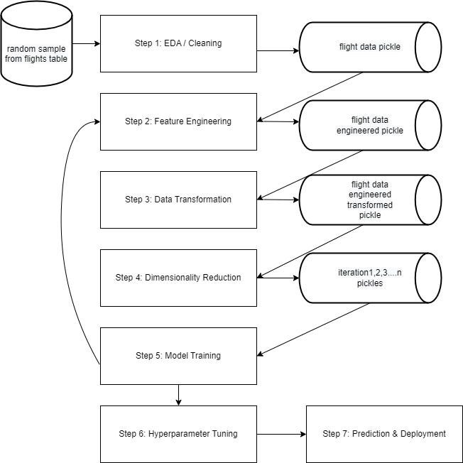

# LHL_midterm_flight_delay
Caleb Ward and Jessica Moloney's LHL midterm project

## Project and Goals

In our midterm project we are looking to predict the delay of flights arriving in the US.

## Process

## Results

Refer to [submission.csv](data/submission.csv) for model predictions on flights_test data.
